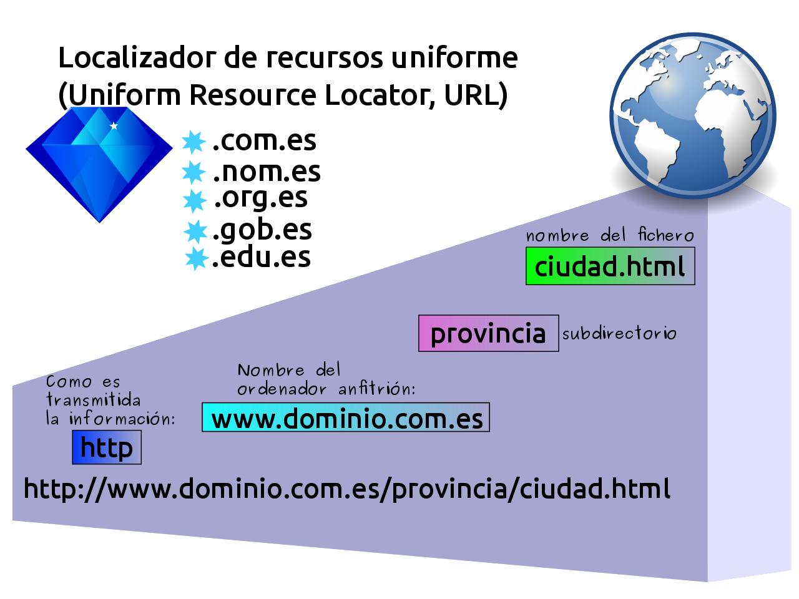
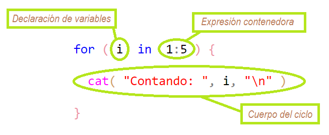

```{r, echo=FALSE}
knitr::opts_chunk$set(fig.width=6, fig.height=4) 
```


# <span style="color: skyblue; font-size: 42px;"><b>¿Cómo realizar un raspado masivo de un sitio estático?</span></b>{style="margin-top: 25px;"}

<style>

body {
  background-image: 
  url(https://estacionlastarria.cl/wp-content/uploads/2021/05/EstLastarria_Horiz_Enviar-01-2048x1011.png),
  url(https://estacionlastarria.cl/wp-content/uploads/2021/05/EstLastarria_Horiz_Enviar-01-2048x1011.png), 
  url(https://estacionlastarria.cl/wp-content/uploads/2021/05/EstLastarria_Horiz_Enviar-01-2048x1011.png), 
  url(https://estacionlastarria.cl/wp-content/uploads/2021/05/EstLastarria_Horiz_Enviar-01-2048x1011.png);
  background-size: 12%, 12%, 12%, 12%;
  background-repeat: no-repeat, no-repeat, no-repeat, no-repeat;
  background-position: 95% 95%, 95% 5%, 5% 5%, 5% 95%;
}

</style>

<p style="font-size: 30px; text-align: justify; margin-top: 45px;">La clave para raspar de forma masiva el contenido específico de un sitio con páginas estáticas es la construcción de un listado (vector) de **urls** desde distintas páginas estáticas.</p>

<p style="font-size: 30px; text-align: justify; margin-top: 25px;">Una vez que logramos armar el listado podemos recorrer cada una de las páginas para extraer el contenido deseado.</p>

<p style="font-size: 30px; text-align: justify; margin-top: 25px;">El recorrido página por página lo podemos automatizar con un ciclo `for`. Pero antes de ver qué es un ciclo `for` recordemos qué es una url.</p>


## <b>Qué es un **url**</b>{style="color: darkred; margin-top: -15px;"}

<div style="font-size: 24px; text-align: justify; color: darkorange; margin-top: 1px;">

URL significa (en castellano) **Localizador de Recursos Uniforme**. En concreto, los URLs son cadenas de caracteres con las que se asigna una dirección única a cada uno de los recursos de información disponibles en Internet. Existe un único URL para cada recurso de Internet. El URL de un recurso es su dirección en Internet, la cual permite que el navegador la encuentre. El formato general de un URL es: :esquema://máquina/directorio/archivo

</div>

<div style="margin-top: -10px;">
{width=50%}
</div>

<div style="font-size: 20px; color: skyblue; margin-top: -10px;">>
<b>
[Más info sobre los URLs](https://es.wikipedia.org/wiki/Localizador_de_recursos_uniforme)
</b>
</div>

# <b>Introducción al ciclo `for`</b>{style="color: darkred; font-size: 50px; margin-top: -5px;"}

<div style="font-size: 25px; text-align: justify; margin-top: -5px;">El ciclo **for** es uno de los más utilizados en programación debido a que permite repetir varias instrucciones un cierto número de ocasiones (por ejemplo, 5 veces). Se emplea en el recorrido de vectores y otras estructuras de datos. 
</div>

<div style="font-size: 20px; text-align: justify; margin-top: -5px;">
**Características**:
</div>

<div style="font-size: 20px; text-align: justify; margin-top: 5px;">
- Siempre se hace uso de una variable (contador) que incrementará su valor automáticamente y ayudará a determinar si se continúa o finaliza el ciclo.
</div>

<div style="font-size: 20px; text-align: justify; margin-top: 5px;">
- El contador deberá inicializarse con un valor, generalmente 0 o 1.
</div>

<div style="font-size: 20px; text-align: justify; margin-top: 5px;">
- Un ciclo puede contener otro ciclo dentro de sí (a esto se le denomina ciclo anidado).
</div>

<div style="margin-top: -15px;">
{width=50%}
</div>

<div style="font-size: 20px; color: skyblue; margin-top: -15px;">>
<b>
[Más info sobre el ciclo `for`](https://es.wikipedia.org/wiki/Bucle_for)
</b>
</div>

## <b>{purrr} un paquete de funciones para iterar</b>{style="color: darkred; margin-top: 30px;"}

<p style="font-size: 36px; text-align: justify; color: darkorange; margin-top: 50px;">El paquete {purrr} mejora el conjunto de herramientas de programación funcional de R al proporcionar un conjunto completo y consistente de herramientas para trabajar con funciones y vectores. Este paquete tiene funciones que le permiten reemplazar muchos bucles for con código más breve y más fácil de leer.</p>

<div style="font-size: 20px; color: skyblue; margin-top: 50px;">>
<b>
[Más info sobre la función `html_text()`](https://purrr.tidyverse.org/)
</b>
</div>

## <b>La función `map_df()`</b>{style="color: darkred; margin-top: 10px;"}

<p style="font-size: 36px; text-align: justify; color: darkorange; margin-top: 10px;">Las funciones `map` transforman su entrada aplicando una función a cada elemento de una lista o vector atómico y devolviendo un objeto de la misma longitud que la entrada.</p>

```{r purrr}
library(purrr)
map_vec(1:9, sqrt)

```


<div style="font-size: 20px; color: skyblue; margin-top: 40px;">>
<b>
[Más info sobre las funciones `map`](https://purrr.tidyverse.org/reference/map.html)
</b>
</div>


# <b>Colecciones de urls</b>{style="color: darkred; margin-top: 10px;"}

<p style="font-size: 30px; text-align: justify; color: darkorange; margin-top: 20px;">Un truco para crear listas con miles de urls consiste en descubrir la estructura url de las páginas individuales. Un ejemplo son las páginas de periódicos y sus páginas de notas individuales: [https://www.lacapitalmdp.com/notas-al-pie-de-la-pandemia-sin-perder-la-ternura-jamas/4656/](https://www.lacapitalmdp.com/notas-al-pie-de-la-pandemia-sin-perder-la-ternura-jamas/4656/)</p>

```{r}
urls <- paste0("https://www.lacapitalmdp.com/notas/", 1999:4999)
head(urls)
```

## <b>{httr} un paquete complementario para {rvest}</b>{style="color: darkred; margin-top: 40px; font-size: 51px;"}

<p style="font-size: 36px; text-align: justify; color: darkorange; margin-top: 80px;">Este paquete contiene herramientas útiles para trabajar con HTTP organizado por verbos HTTP (GET(), POST(), etc). Las funciones de configuración facilitan el control de componentes de solicitud adicionales.</p>

<div style="font-size: 20px; color: skyblue; margin-top: 80px;">>
<b>
[Más info sobre las funciones de la librería {httr}](https://httr.r-lib.org/)
</b>
</div>
