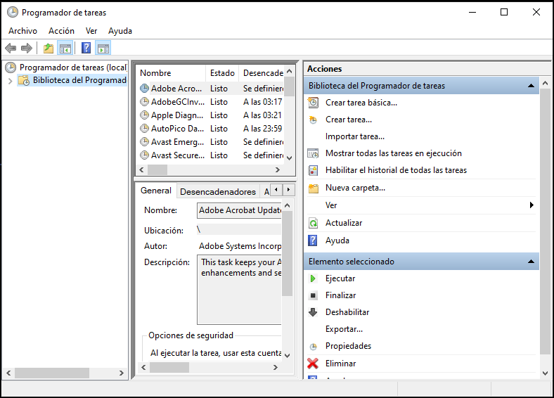
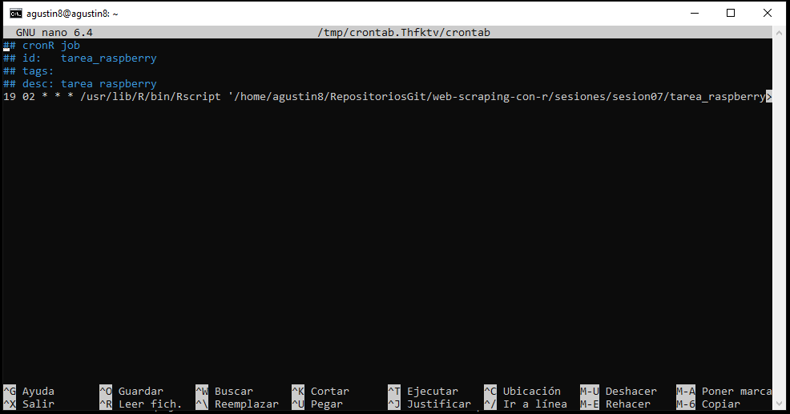
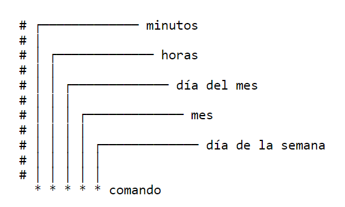

```{r, echo=FALSE}
knitr::opts_chunk$set(fig.width=6, fig.height=4) 
```


# <span style="color: skyblue; font-size: 58px;"><b>Programar tareas: ¿para qué?</span></b>{style="margin-top: -1px;"}

<style>

body {
  background-image: 
  url(https://estacionlastarria.cl/wp-content/uploads/2021/05/EstLastarria_Horiz_Enviar-01-2048x1011.png),
  url(https://estacionlastarria.cl/wp-content/uploads/2021/05/EstLastarria_Horiz_Enviar-01-2048x1011.png), 
  url(https://estacionlastarria.cl/wp-content/uploads/2021/05/EstLastarria_Horiz_Enviar-01-2048x1011.png), 
  url(https://estacionlastarria.cl/wp-content/uploads/2021/05/EstLastarria_Horiz_Enviar-01-2048x1011.png);
  background-size: 12%, 12%, 12%, 12%;
  background-repeat: no-repeat, no-repeat, no-repeat, no-repeat;
  background-position: 95% 95%, 95% 5%, 5% 5%, 5% 95%;
}

</style>

<p style="font-size: 28px; text-align: justify;">En sistemas operativos como Windows, macOS y Linux programar tareas es útil ya que permite automatizar tareas que necesitan ser realizadas de forma regular.</p>

<p style="font-size: 28px; text-align: justify;">Algunos ejemplos de tareas que se pueden programar son:</p>

<div style="font-size: 25px; text-align: justify;">
- Ejecutar un script de limpieza o mantenimiento del sistema a una hora determinada.
- Hacer copias de seguridad de tus archivos en un intervalo regular.
- Enviar un correo electrónico a una hora determinada.
- Actualizar una base de datos o una aplicación a una hora determinada.
- Ejecutar una aplicación o script de forma periódica para recopilar datos o realizar cálculos.
</div>

<p style="font-size: 28px; text-align: justify;">En resumen, programar tareas es muy útil para realizar tareas de forma automática y sin tener que intervenir manualmente. Puede ahorrarte tiempo y esfuerzo y asegurar que las tareas se realizan de forma consistente y precisa.</p>

## <b>Utilidades</b>{style="color: skyblue; font-size: 60px; margin-top: -10px;"}

<div style="font-size: 29px; text-align: justify; color: darkred;">
- **Ahorro de tiempo y esfuerzo**: al no tener que realizar manualmente las mismas tareas una y otra vez.

- **Consistencia y precisión**: programar y automatizar tareas reduce el margen de errores humanos.

- **Eficiencia**: la automatización de tareas puedes aumentar la eficiencia y productividad del sistema ya que las tareas se realizarán sin interrupciones.

- **Flexibilidad**: se puede  adaptar la automatización de tareas a necesidades específicas para que se ejecuten en un horario determinado, a intervalos regulares, o cuando se produce un evento específico.

- **Seguridad**: aumenta al programar tareas de mantenimiento y limpieza de forma regular.

</div>

# <b>En Windows</b>{style="color: orange; font-size: 50px; margin-top: -5px;"}



## <b>Programador de tareas</b>{style="color: orange; font-size: 50px; margin-top: 10px;"}

<p style="font-size: 32px; text-align: justify; margin-top: 35px; color: purple;">En Windows, el programador de tareas es una herramienta incorporada en el sistema operativo que te permite programar tareas para que se ejecuten en un horario determinado, a intervalos regulares, o cuando se produce un evento específico. Puedes utilizar el programador de tareas para ejecutar cualquier aplicación o script en el sistema, y puedes especificar diferentes opciones y parámetros para personalizar la forma en que se ejecutan las tareas.</p>

<p style="font-size: 32px; text-align: justify; margin-top: 35px; color: purple;">Además del Programador de tareas incorporado, también hay muchas otras aplicaciones y librerías de terceros disponibles para programar tareas en Windows. Algunas de las más populares son: Freebyte Task Scheduler, Shutter, Task Till Dawn, Z-Cron.</p>

## <b>Con R y RStudio</b>{style="color: orange; font-size: 50px; margin-top: 5px;"}

<p style="font-size: 27px; text-align: justify; margin-top: 5px; color: purple;">La libraría que vamos a usar para programar tareas de R en Windows es {taskscheduleR}.</p>

<p style="font-size: 27px; text-align: justify; margin-top: 5px; color: purple;">**taskscheduleR** es una librería de R que proporciona una interfaz para crear y administrar tareas programadas en el sistema operativo Windows. Permite a lxs usuarixs programar scripts de R para que se ejecuten automáticamente en un horario específico, sin la necesidad de intervención manual. La librería utiliza el sistema de tareas programadas de Windows para crear y programar las tareas, lo que significa que las tareas creadas con taskscheduleR pueden ser administradas y modificadas mediante la herramienta de tareas programadas de Windows.</p>

<p style="font-size: 27px; text-align: justify; margin-top: 5px; color: purple;">**taskscheduleR** también proporciona funciones para verificar si una tarea programada existe, leer las propiedades de una tarea programada y eliminar tareas programadas existentes. </p>

<p style="font-size: 27px; text-align: center; margin-top: 5px; color: darkred;">[Más sobre taskscheduleR](https://github.com/bnosac/taskscheduleR)</p>

# <b>En Ubuntu/Debian</b>{style="color: orange; font-size: 50px; margin-top: 25px;"}



## <b>cron & crontab</b>{style="color: orange; font-size: 50px; margin-top: 25px;"}

<p style="font-size: 32px; text-align: justify; margin-top: 35px; color: purple;">En sistemas operativos basados en Linux, como Ubuntu y Debian, hay varias herramientas que se pueden utilizar para programar tareas. Entre esas herramientas están cron y crontab. Cron es un administrador regular de procesos en segundo plano que se encarga de ejecutar tareas a intervalos regulares especificados en un archivo de configuración llamado crontab.</p>

<p style="font-size: 32px; text-align: justify; margin-top: 35px; color: purple;">Además de las herramientas incorporadas, también hay muchas otras aplicaciones y librerías de terceros disponibles para programar tareas en sistemas operativos basados en Linux. Algunas de las más populares son: at, fcron, dcron, systemd.</p>

## <b>Con R</b>{style="color: orange; font-size: 50px; margin-top: 25px;"}

<p style="font-size: 27px; text-align: justify; margin-top: 5px; color: purple;">La libraría que vamos a usar para programar tareas de R en Linux es {cronR}.</p>

<p style="font-size: 27px; text-align: justify; margin-top: 5px; color: purple;">**cronR** es similar en funcionamiento a taskscheduleR pero se enfoca en los sistemas operativos Linux en lugar de Windows. La librería proporciona una interfaz para el sistema de programación de tareas cron en Linux.</p>

<p style="font-size: 27px; text-align: justify; margin-top: 5px; color: purple;">La librería también proporciona funciones para crear, leer, actualizar, y eliminar tareas programadas en el sistema cron, así como también para listar las tareas programadas existentes. Al igual que taskscheduleR, cronR es fácil de usar y está diseñado para ser lo más compatible posible con las funciones de programación de tareas del sistema cron.</p>

<p style="font-size: 27px; text-align: center; margin-top: 5px; color: darkred;">[Más sobre cronR](https://github.com/bnosac/cronR)</p>

## <b>cronR en una Raspberry Pi</b>{style="color: orange; font-size: 50px; margin-top: 45px;"}


## <b>¿Qués es una Raspberru Pi?</b>{style="color: orange; font-size: 50px; margin-top: 25px;"}

<p style="font-size: 30px; text-align: justify; margin-top: 5px; color: purple;">La **Raspberry Pi** es una computadora completa que viene en una placa pequeña y compacta, con todos los componentes necesarios para funcionar, como un procesador, memoria RAM, conectividad de red y puertos USB. La placa usa un sistema operativo llamado Raspbian, basado en Linux, pero también se pueden instalar otros sistemas operativos.</p>

<p style="font-size: 30px; text-align: justify; margin-top: 5px; color: purple;">La **Raspberry Pi** tiene una serie de características que la hacen atractiva para una variedad de aplicaciones, incluyendo su bajo costo, su tamaño pequeño y portabilidad, su capacidad para ejecutar un sistema operativo completo y su soporte para una amplia variedad de periféricos y add-ons. Algunos ejemplos comunes de proyectos que utilizan la Raspberry Pi incluyen media centers, servidores web, robots y sistemas de seguridad.</p>

## <b>cronR en un VPS</b>{style="color: orange; font-size: 50px; margin-top: 55px;"}


## <b>¿Qués es un VPS?</b>{style="color: orange; font-size: 50px; margin-top: 25px;"}

<p style="font-size: 30px; text-align: justify; margin-top: 5px; color: purple;">**VPS**, o Virtual Private Server, es un tipo de alojamiento web que proporciona un servidor virtual privado a lxs usuarixs. Un VPS es similar a un servidor dedicado, pero se divide en varios servidores virtuales que funcionan independientemente entre sí. Cada servidor virtual tiene su propia capacidad de procesamiento, memoria y almacenamiento, y se puede configurar y administrar de manera independiente.</p>

<p style="font-size: 30px; text-align: justify; margin-top: 5px; color: purple;">En un VPS, lxs usuarixs tienen control completo sobre el software y la configuración de su servidor virtual, lo que les permite instalar y ejecutar sus propias aplicaciones y programas, así como configurar el sistema operativo y el software de red. Además, un VPS proporciona un entorno seguro y aislado para ejecutar aplicaciones y sitios web, ya que los recursos de un VPS no están disponibles para otrxs usuarixs.</p>

# <b>Misceláneas</b>{style="color: orange; font-size: 70px; margin-top: 125px;"}

## <b>Algoritmo de cron</b>{style="color: orange; font-size: 50px; margin-top: 5px;"}

{width=70%}
<p style="font-size: 20px;">[*FUENTE*](https://tecnolitas.com/blog/programador-de-tareas/)</p>

## <b>Estructura de cron</b>{style="color: orange; font-size: 50px; margin-top: 35px;"}



<p style="font-size: 20px;">[*FUENTE*](https://blog.ahierro.es/programar-tareas-en-ubuntu-con-cron/)</p>

## <b>Links de interés</b>{style="color: orange; font-size: 50px; margin-top: 45px;"}

<div style="font-size: 35px; margin-top: 45px;">

- [How to schedule R scripts](https://www.r-bloggers.com/2020/05/how-to-schedule-r-scripts/)

- [Algo más sobre taskscheduleR](http://www.bnosac.be/index.php/blog/50-taskscheduler-r-package-to-schedule-r-scripts-with-the-windows-task-manager-2)

- [Automatizar Rutinas con R](http://rstudio-pubs-static.s3.amazonaws.com/500566_86b0b95988794decb768d305efebb520.html)

- [crontab guru](https://crontab.guru/)

</div>
